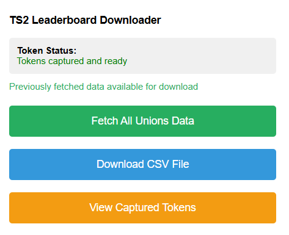

**Instructions:**
- Download the files
- Place them in a folder
- Open chrome: extensions
- Click "Developer Mode"
- Click "Load Unpacked"
- Point it at the folder you made above
- In the extension screen, click "on", then "Pin to toolbar"

**To collect Union data:**
- Open the game in the browser (https://portal.pixelfederation.com/en/trainstation2)
- Click the extension icon in the browser
- Click "Fetch All Unions Data"
- When it's finished, click "Download CSV File"

**Created by:**
- Mihalj (BNGZR)
- Juggernaut (BNGZR)

**Documented and minor editing by:** 
- Ruby on Rails (BNGZR)

Find us in Discord: 
https://discord.gg/jUnmeaeSad
